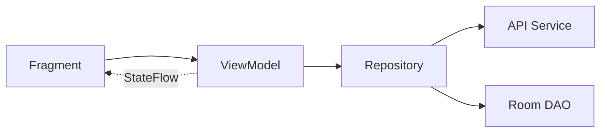

# PoopyFeed Android

Native Android app for PoopyFeed — a baby care tracking
application for logging feedings, diapers, and naps.
Connects to the same Django REST API as the Angular web
frontend.

## Tech Stack

- **Language**: Kotlin 2.3.10
- **Min SDK**: 24 (Android 7.0) / **Target SDK**: 36
- **Build**: AGP 9.0.1 with built-in Kotlin support
- **Architecture**: Single-activity MVVM with Jetpack Navigation
- **UI**: XML layouts with ViewBinding
- **DI**: Hilt 2.59.2
- **Networking**: Retrofit + OkHttp + kotlinx.serialization
- **Local Storage**: Room database with cached repositories
- **Testing**: JUnit 4 + MockK + Robolectric + Kover (85% minimum enforced)

## Features

- **Authentication** — Login/signup/logout via django-allauth headless flow
- **Children Management** — List, create, and view child profiles
- **Activity Tracking** — View last feeding, diaper, and nap timestamps
- **Account Settings** — Profile editing, password change, account deletion
- **Timezone Detection** — Detects device/profile
  timezone mismatch with correction banner
- **Offline Feedback** — Instant connectivity check before API requests
- **Cached Data** — Room-backed repositories with network sync and pull-to-refresh

## Getting Started

### Prerequisites

- Android Studio (latest stable)
- JDK 17+
- Android SDK 36
- Running backend (`make run` from the root poopyfeed repo)

### Setup

From the **android** directory (where the Makefile lives):

```bash
# Clone (if not already part of the monorepo)
git clone <repo-url>
cd android

# Build debug APK
make build-debug

# Install on emulator/device
make install

# Build + install + launch
make run
```

The debug build points to `http://10.0.2.2:8000`
(emulator localhost alias). For physical devices, update
the API base URL to your machine's IP.

## Development

### Common Commands

```bash
make build-debug    # Build debug APK
make build-release  # Build release APK (unsigned)
make install        # Install debug APK (builds if needed)
make run            # Build, install, and start app
make start          # Start app (requires installed APK)
make clean          # Clean build artifacts

make test           # Run unit tests
make coverage       # Kover coverage report (85% minimum enforced)
make lint           # Run Android lint
make lint-fix       # Update lint baseline
make format         # Format Kotlin code (Spotless/ktfmt)

make devices        # List connected devices/emulators
make logs           # adb logcat filtered to net.poopyfeed.pf
```

### Running Specific Tests

From the android directory:

```bash
cd poopyfeed

# Single test class
./gradlew test --tests "net.poopyfeed.pf.LoginViewModelTest"

# Single test method
./gradlew test --tests "net.poopyfeed.pf.LoginViewModelTest.testLoginSuccess"

# Pattern matching
./gradlew test --tests "*ViewModel*"
```

### Pre-commit Hooks

```bash
make pre-commit-setup   # From root poopyfeed repo
```

Enforces conventional commits, trailing whitespace,
LF line endings, and no private keys.

## Project Structure

Paths below are relative to the **poopyfeed** app module (`poopyfeed/app/`):

```text
poopyfeed/app/src/main/java/net/poopyfeed/pf/
├── data/
│   ├── api/           # Retrofit API service
│   ├── db/            # Room database, DAOs, entities
│   ├── models/        # API models & error handling
│   ├── repository/    # Network-only & cached repositories
│   └── session/       # Session/auth utilities
├── di/                # Hilt modules (Network, Database, TokenManager)
├── [UI layer]         # Fragments, ViewModels, Adapters
│   ├── MainActivity
│   ├── Login/Signup
│   ├── Home
│   ├── ChildrenList/ChildDetail
│   ├── CreateChildBottomSheet
│   └── AccountSettings
└── PoopyFeedApplication.kt
```

## Architecture



- **Sealed UI states** per screen (Loading, Ready, Error, etc.)
- **StateFlow** for reactive state management
- **Cached repositories** use Room as source of truth with network sync
- **Coroutines** with `viewLifecycleOwner.lifecycleScope` + `repeatOnLifecycle`

## Conventional Commits

All commits must follow conventional commit format:

```text
<type>(<scope>): <subject>

Types: feat, fix, docs, style, refactor, test, chore
```

## License

See repository root for license information.
